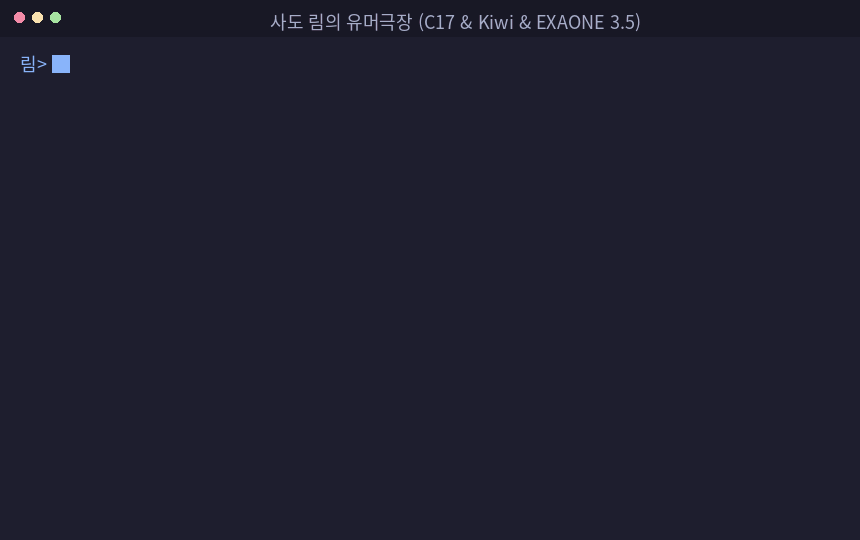

# RimLang (림언어)

[](https://en.wikipedia.org/wiki/C17_(C_standard_revision))
[](https://github.com/bab2min/kiwipiepy)
[-orange.svg)](https://ollama.com)

**RimLang**은 서브컬처 게임 *트릭컬 리바이브(Trickcal Revive)*의 사도 **림(Rim)**의 썰렁개그, 언어유희 및 서브컬처 밈 구문을 바탕으로 동작하는 C17 기반의 난해(Esoteric) 프로그래밍 언어입니다.

C17 튜링 완전 가상머신, 오픈소스 한국어 형태소 분석기 **Kiwi**, 그리고 한국어 특화 이중언어 경량 LLM(**EXAONE 3.5 2.4B**)이 결합된 **하이브리드(Hybrid) 아키텍처**로 동작합니다.

---

## 📸 실행 화면 (사도 림의 유머극장)



---

## 🛠️ 빌드 및 설치 방법 (Build & Installation)

### 1. 사전 요구사항 (Prerequisites)
- **C 컴파일러**: GCC (C17 지원) 또는 Clang
- **Python**: Python 3.8 이상
- **빌드 도구**: `make`
- **로컬 LLM 지원**: [Ollama](https://ollama.com) 및 `exaone3.5:2.4b` 모델 (`ollama pull exaone3.5:2.4b`)

### 2. 원클릭 가상환경 설치 마법사 (`install.sh`)
```bash
chmod +x install.sh
./install.sh
```

### 3. 수동 빌드 및 테스트
```bash
make all   # 인터프리터 및 테스트 러너 빌드
make test  # 튜링 완전성 및 AST 테스트 스위트 실행
make clean # 빌드 산출물 및 임시 파일 정리
```

---

## 🚀 실행 방법 (Usage)

### 1. 대화형 인터프리터 (Interactive REPL)
```bash
./rimlang
```

### 2. 멀티프로세스 비동기 워커 풀 모드 (-j 옵션)
```bash
./rimlang -j 4
```

### 3. 공식 예제 스크립트 실행
```bash
# 예제 1: 정통 림언어 썰렁개그 & 미세 형태소 분해
./rimlang examples/trickcal_rim_sum_squares.rim

# 예제 2: 창작 썰렁개그 함수 & 방언 호환
./rimlang examples/creative_rim_jokes.rim

# 예제 3: 튜링 완전 OISC 연산 -> 표준 I/O("림...") -> LLM 추론 파이프라인
./rimlang examples/turing_io_llm_pipeline.rim

# 예제 4: 교주님 블록, 가드 블록 및 함수 연계
./rimlang examples/guarded_program_block.rim
```

---

## 🧠 아키텍처 및 파이프라인 구조

림언어는 결정론적 문법·산술 평가와 신경망 추론을 명확히 분리하여 처리합니다.

```
                      [ RimLang 프로그램 / REPL 입력 ]
                                     │
                                     ▼
        ┌────────────────────────────────────────────────────────┐
        │  1. 결정론적 언어 코어 (C17 AST Engine & Kiwi NLP)     │
        ├────────────────────────────────────────────────────────┤
        │ • 사용자 정의 함수 블록 (`림하하...` ~ `하하...림...`)  │
        │ • 튜링 완전 OISC 연산 (SBN, FlipJump)                  │
        │ • 프로그램 블록 (`교주님...` ~ `흡...흐흡...`)          │
        │ • LLM 차단 가드 블록 (`크흡...` ~ `흡...흐흡...`)        │
        │ • 표준 I/O 함수 (`림...` 출력, `흡...` 입력)           │
        │ • 합성어 미세 형태소 분해 (`통모짜`+`핫`+`도그`)       │
        │ • 접두 구분자 (`.....냉각기` -> `냉.무`)               │
        │ • 산술 연산자 (+, -, *, /) 및 변수 바인딩             │
        │ • 삼항 조건 분기 (해골 가면 림 vs 안 쓴 림)            │
        │ • 구체 타입 단언 (assert: not just a not)              │
        │ • 비명 서브스트링 연산식 (케이크 -> '이크')            │
        │ • 한영 표기 디코딩 및 사투리 음운 변동 정규화         │
        └────────────────────────────┬───────────────────────────┘
                                     │
                 (가드 블록 외부의 열린 창작 / 연상 질의)
                                     │
                                     ▼
        ┌────────────────────────────────────────────────────────┐
        │  2. 신경망 의미 오라클 (EXAONE 3.5 2.4B via Ollama)    │
        ├────────────────────────────────────────────────────────┤
        │ • 기계적 규칙이 없는 창작 썰렁개그 실시간 추론         │
        │ • 한국어-영어 이중언어 음운 유희 합성                  │
        │ • 자유 대화 및 열린 의미 질문 처리                    │
        └────────────────────────────────────────────────────────┘
```

---

## 📖 핵심 문법 및 키워드 규약

### 1. 사용자 정의 함수 및 블록 스코프
| 문법 키워드 | 역할 및 설명 |
|---|---|
| `림하하...` <이름> ~ `하하...림...` | **사용자 함수 정의 블록**: 특정 단어를 함수로 선언하여 내부 튜링/연산 구문 평가 결과를 항상 반환 |
| `교주님...` ~ `흡...흐흡...` | **결정론적 프로그램 블록**: 산술 및 OISC 메모리 제어식을 연속으로 실행하는 스코프 |
| `크흡...` ~ `흡...흐흡...` | **LLM 평가 차단 가드 블록**: 내부 구문에 대해 **LLM 오라클 평가를 100% 차단**하고 순수 C17/Kiwi 엔진으로만 평가 |

### 2. 표준 입출력 (I/O) 함수
| 문법 키워드 | 역할 및 설명 | 실행 예시 |
|---|---|---|
| `림... <내용>` | **표준 출력**: 림의 대사를 터미널에 출력 | `림... 오늘의 만담 퀴즈를 시작하겠습니다!` |
| `흡...` | **표준 입력**: 사용자로부터 한 줄을 입력받아 변수에 바인딩 | `흡...` |

### 3. 미세 형태소 분해 및 결정론적 OISC
| 문법 패턴 | 분류 | 설명 및 동작 |
|---|---|---|
| `통모짜핫도그` | 형태소 분해 | `통모짜`(요즘잘자) + `핫`(쿨) + `도그`(냥이) $\rightarrow$ `요즘잘자쿨냥이` |
| `.....<단어>` | 접두 구분자 | 단어의 첫 글자를 추출하여 상태 축약자 생성 (`.....냉각기` $\rightarrow$ `냉.무`) |
| `a에서 b를 흘려서 c가 되면...?` | SBN OISC | `Memory[a] -= Memory[b]; if (Memory[a] <= 0) PC = c;` |
| `A 후라이팬에 B를 뒤집으면 C로...?` | FlipJump OISC | `Memory[A] ^= (1 << B); PC = C;` |
| `X가 지르는 비명은...?` | 형태소 연산 | 첫 음절 탈락 서브스트링 추출 (`케이크` $\rightarrow$ `이크`) |
| `X 중에 가장 예의가 없는 X는?` | 언어유희식 | 다대일 매핑 및 4개 점(....) 종결 (`메론빵`) |
| `... 나누어 ... 낯.가.림 ...` | 조건 분기 | 삼항연산자 조건 완성 분기 |
| `친구가 없을 때 ... not just a not` | 타입 단언 | 구체 타입 단언 (assert & 한영 치환) |

---

## 📁 프로젝트 구조

```
.
├── include/rim/         # C17 헤더 파일 (AST, Parser, Lexer, Runtime, Engine, NLP)
├── src/
│   ├── main.c          # REPL 및 CLI 진입점
│   ├── engine/         # 멀티프로세스 비동기 워커 풀
│   ├── parser/         # 렉서, 파서, Kiwi NLP IPC 바인딩
│   └── runtime/        # 튜링 완전 OISC VM, 함수 디스패처, 가드 블록 및 I/O
├── examples/           # 공식 림언어 소스 (.rim)
│   ├── trickcal_rim_sum_squares.rim  # 예제 1: 정통 림언어 & 형태소 분해
│   ├── creative_rim_jokes.rim        # 예제 2: 창작 썰렁개그 함수 & 방언
│   ├── turing_io_llm_pipeline.rim    # 예제 3: OISC 함수 + I/O + LLM 파이프라인
│   └── guarded_program_block.rim     # 예제 4: 교주님 블록, 가드 블록 및 함수 연계
├── util/               # Python NLP/LLM 브리지 및 GIF 렌더러
│   ├── kiwi_bridge.py  # Kiwi 형태소 및 음운 정규화 브리지
│   ├── llm_pun_engine.py # Ollama EXAONE 3.5 2.4B 연동 모듈
│   └── make_gif.sh     # 터미널 세션 GIF 녹화 스크립트
├── tests/              # C 단위 테스트 스위트
├── install.sh          # 대화형 가상환경 및 종속성 설치기
├── Makefile            # C17 컴파일 빌드 스크립트
├── MANUAL.md           # 상세 언어 레퍼런스 매뉴얼
└── README.md           # 프로젝트 소개 및 빌드 가이드
```

---

## 📄 라이선스
MIT License
